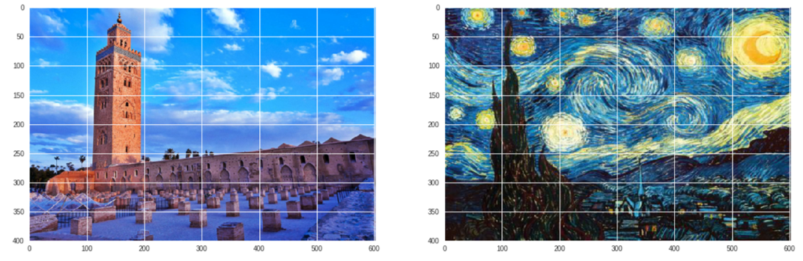

# Neural Style Transfer -NST-

In this project, we will apply neural style transfer to extract the style from one image and use it to decorate another one. By the end of this tutorial, you will be able to use deep learning in order to compose images in the style of another image, thus to generate beautiful works of art with NST.

To do so we used the pretrained CNN VGG19 and the open source Machine Learning library PyTorch.

## Style Transfer

Neural style transfer is the process of:

1- Taking the style of one image

2- And then applying it to the content of another image

The original neural style transfer algorithm was introduced by Gatys et al. in their 2015 paper : *A Neural Algorithm of Artistic Style*, in which they propose a NST algorithm that does not require a new architecture at all; instead, you can take a pre-trained network (typically on ImageNet, like VGG19 used here in our implementation) and define a loss function that will enable you to achieve your end goal of style transfer and then optimize over that loss function.

## VGG 19

VGG-19 is a convolutional neural network that is trained on more than a million images from the ImageNet database. The network is 19 layers deep and can classify images into 1000 object categories, such as keyboard, mouse, pencil, and many animals. As a result, the network has learned rich feature representations for a wide range of images [[1]](https://www.mathworks.com/help/deeplearning/ref/vgg19.html;jsessionid=e70a2d83201fa5c8ee870d562f8e "VGG19")

  

## PyTorch

PyTorch is a Python-based, optimized, open-source deep learning library that uses both GPUs and CPUs.

PyTorch seems to be nice for experimenting with algorithms and it's simple to debug. It is essentially like using Numpy with the option of using GPU acceleration if you want. It has some useful modules for neural networks, optimization and auto gradients. [[2]](https://www.pugetsystems.com/labs/hpc/Why-You-Should-Consider-PyTorch-includes-Install-and-a-few-examples-1193/ "pytorch")

## Results

  

  

